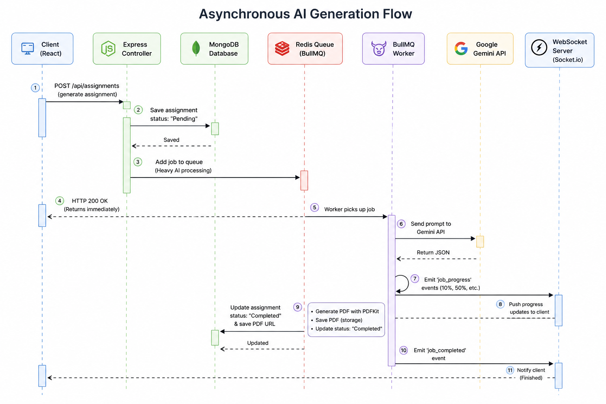
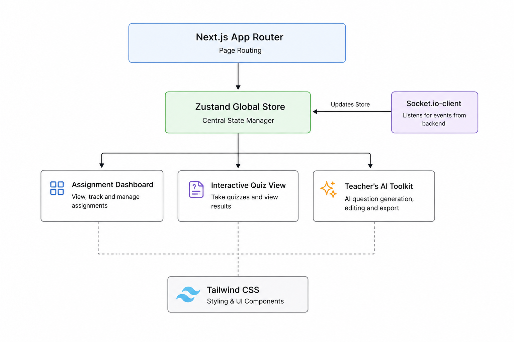

<div align="center">
  <h1>VedaAI • AI Assessment Creator</h1>
  
  <p>
    <strong>A highly scalable, production-ready assessment engine built for modern educators.</strong><br/>
    <em>Full Stack Engineering Assignment Submission</em>
  </p>
  
  <a href="https://vedaai-5ro9.onrender.com/">
    
  </a>
  <br/><br/>

  
  
  
  
  
</div>

---

## 📌 Executive Summary

**VedaAI** is not just an API wrapper; it is an enterprise-grade EdTech platform engineered for high concurrency and heavy LLM workloads. It empowers educators to effortlessly generate fully structured, curriculum-aligned exam papers and interactive quizzes.

By decoupling the AI inference via **BullMQ/Redis background workers**, rendering **native A4 PDFs programmatically via PDFKit**, and driving the UX with **WebSockets**, VedaAI delivers a flawless, real-time user experience without risking HTTP timeouts or frozen browsers.

---

## 🎯 Project Expectations vs. Delivery

We strictly adhered to the assignment rubric and successfully implemented every required constraint, alongside all requested bonus features.

| Requirement Area | Expectation | Implementation Details | Status |
| :--- | :--- | :--- | :---: |
| **Frontend UI** | Match Figma designs | Pixel-perfect Tailwind implementation. Glassmorphism, smooth micro-animations, and strict mobile responsiveness (no horizontal overflow). Includes **Dark Mode**. | ✅ |
| **Form Data** | Due date, question types, marks, instructions | Full form with robust validation integrated with **Zustand**. Supports **Voice Assistance** for instructions and **Pasting Reference Text**. | ✅ |
| **AI Generation** | Structured prompts, grouped sections, difficulty tags | Enforced `application/json` schema on Gemini. The frontend parses JSON; it **never** renders raw LLM text. | ✅ |
| **Backend System** | Node.js + Express (TypeScript) | Strongly typed controllers, async handlers, and robust REST APIs. | ✅ |
| **Database** | MongoDB | Storing Assignments and auto-graded Submissions. | ✅ |
| **Async Queues** | Redis + BullMQ | Heavy LLM tasks are pushed to `generationQueue`. Prevents HTTP timeouts. | ✅ |
| **Real-time UX** | WebSockets | Worker emits `10%`, `50%`, `100%` progress updates directly to the React frontend via Socket.io. | ✅ |

---

## 🚀 Additional & Bonus Features

Beyond the core rubric, this project implements advanced features expected in enterprise SaaS applications:

| Feature | Description |
| :--- | :--- |
| 🌙 **Dark Mode Support** | A fully integrated dark theme that dynamically switches based on user preference for a sleek, modern look. |
| 🎙️ **Voice Assistance (Speech-to-Text)** | Teachers can use their microphone to dictate the "Additional Instructions" natively within the Assignment Creation form! |
| 📝 **Advanced Assignment Editing** | Generated assignments aren't static. Teachers can **Regenerate** the paper, perform **Manual Edits** on specific questions, and select specific **Classes & Subjects** during creation. Instead of complex document uploads, teachers can instantly **Paste Reference Text** for the AI to base questions on. |
| 🎮 **Interactive "Take Quiz" & View Responses** | Converts the static exam paper into an interactive digital quiz. Students can take the test directly in the browser, and teachers can view all submitted responses natively within the app. |
| 🛠️ **AI Teacher's Toolkit** | A standalone suite featuring a **Lesson Plan Generator**, **Question Bank Builder**, and **Feedback Enhancer** to automate daily teaching tasks. |
| 🏠 **Homepage & Groups** | Includes a dedicated navigational Home page. Teachers can also "Create Groups" (currently a frontend-only implementation, ready to be wired up to the backend in the future). |
| ⚙️ **Comprehensive Settings** | A robust Settings profile page allowing users to instantly edit their Name, Email, Avatar, and School Name (which is dynamically fetched and updated across the app). |
| 🖨️ **Native Programmatic PDF Generation** | Built a custom `PDFKit` engine on the backend that mathematically draws the exam paper, creates structured headers (Name/Roll Number), and properly paginates the output. It avoids lazy `window.print()` hacks. |
| ☁️ **Ephemeral Cloud Storage Resilience** | Engineered a dynamic fallback endpoint (`/api/assignments/:id/download`). If a cloud host (like Render) wipes the temporary PDF from its disk, the backend instantly regenerates the file on the fly from the database before downloading. |

---

## 🏗️ System Architecture & Data Flow

VedaAI utilizes three core architectural pillars to ensure enterprise-grade stability and user experience:

### 1. Asynchronous AI Generation Flow (Backend)
The system employs a decoupled processing pattern to guarantee reliability during high-latency LLM generation.

<div align="center">
  
</div>

1. **Client Request:** User submits the assignment form. The frontend makes a POST request to `/api/assignments`.
2. **Queueing:** The Express Controller validates the payload, adds the job to the Redis `generationQueue`, and immediately returns an HTTP 200 response to the client.
3. **Background Processing:** A separate BullMQ worker picks up the job, structures the strict prompt, and queries the Google Gemini API.
4. **WebSocket Sync:** During processing, the worker emits granular progress events (`job_progress`) over WebSockets. The React frontend listens to this channel and renders a dynamic loading progress bar.
5. **PDF Compilation:** Once the AI returns the JSON, the worker programmatically draws the PDF using `PDFKit` and saves it to the disk.
6. **Completion:** The MongoDB document is marked "Completed", and the final WebSocket event triggers the frontend to reveal the rendered exam paper.

### 2. Global System Architecture
<div align="center">
  
</div>

### 3. Frontend React Architecture
<div align="center">
  
</div>

---

## 💻 Tech Stack

| Domain | Technologies |
| :--- | :--- |
| **Frontend** | ⚛️ Next.js 14 (App Router) <br> 🎨 Tailwind CSS <br> 🐻 Zustand <br> 🔌 Socket.io-client |
| **Backend** | 🟢 Node.js <br> 🚂 Express.js <br> 📘 TypeScript <br> 🔌 Socket.io <br> 📄 PDFKit |
| **Database & Cache** | 🍃 MongoDB (Mongoose) <br> 🔴 Redis |
| **Queues** | 🐂 BullMQ |
| **AI Integration** | 🧠 Google Gemini API (`@google/genai`) |

---

## 🔌 API Documentation

The backend REST API is structurally modularized. Below are the core endpoints:

### 📝 Assignments API (`/api/assignments`)
| Method | Endpoint | Description |
| :--- | :--- | :--- |
| `POST` | `/` | Creates a new assignment and dispatches the BullMQ generation job. |
| `GET` | `/` | Retrieves a list of all assignments. |
| `GET` | `/:id` | Fetches a specific assignment and its full JSON structure. |
| `POST` | `/:id/regenerate` | Re-runs the Gemini AI generation for an existing assignment. |
| `PUT` | `/:id` | Manually updates/edits assignment question data. |
| `GET` | `/:id/download` | **[Fallback resilient]** Streams generated PDF. Regenerates on-the-fly if wiped. |
| `DELETE` | `/:id` | Deletes the assignment and unlinks physical disk files. |

### 📚 Library API (`/api/library`)
| Method | Endpoint | Description |
| :--- | :--- | :--- |
| `GET` | `/` | Lists all uploaded syllabus/textbook context files. |
| `POST` | `/upload` | Multipart/form-data upload using `multer` (PDF/TXT/DOCX). |
| `GET` | `/:id/download` | Secure streaming of library documents with graceful fallbacks. |
| `DELETE` | `/:id` | Deletes a context file from the DB and ephemeral disk. |

### 🎓 Submissions API (`/api/submissions`)
| Method | Endpoint | Description |
| :--- | :--- | :--- |
| `POST` | `/submit` | Accepts student quiz answers and saves responses/auto-grades. |
| `GET` | `/assignment/:id` | Fetches all submissions/results for a specific assignment. |

### 🛠️ Toolkit API (`/api/toolkit`)
| Method | Endpoint | Description |
| :--- | :--- | :--- |
| `POST` | `/lesson-plan` | Generates a structured lesson schedule via AI. |
| `POST` | `/question-bank` | Synthesizes standalone exam questions via AI. |
| `POST` | `/feedback` | Expands draft remarks into professional teacher feedback. |

### 📊 Dashboard API (`/api/dashboard`)
| Method | Endpoint | Description |
| :--- | :--- | :--- |
| `GET` | `/stats` | Fetches global statistics for the home page. |
| `GET` | `/tasks` | Retrieves the teacher's to-do checklist. |
| `POST` | `/tasks` | Creates a new to-do task. |
| `PUT` | `/tasks/:id/toggle` | Toggles the completion state of a task. |
| `DELETE`| `/tasks/:id` | Deletes a task. |

### 👥 Groups API (`/api/groups`)
| Method | Endpoint | Description |
| :--- | :--- | :--- |
| `GET` | `/` | Retrieves all student groups. |
| `POST` | `/` | Creates a new student group. |
| `DELETE` | `/:id` | Deletes a specific group. |

---

## 🛠️ Local Setup Instructions

1. **Clone the Repository:**
   ```bash
   git clone https://github.com/AkankshaRaj07/VedaAI.git
   cd VedaAI
   ```

2. **Backend Setup:**
   ```bash
   cd backend
   npm install
   ```
   Create a `.env` file in the `backend` directory:
   ```env
   PORT=5000
   MONGODB_URI=mongodb://localhost:27017/vedaai
   REDIS_HOST=localhost
   REDIS_PORT=6379
   GEMINI_API_KEY=your_gemini_api_key_here
   ```
   Start the backend development server:
   ```bash
   npm run dev
   ```

3. **Frontend Setup:**
   ```bash
   cd ../frontend
   npm install
   ```
   Create a `.env.local` file in the `frontend` directory:
   ```env
   NEXT_PUBLIC_API_URL=http://localhost:5000/api
   ```
   Start the frontend development server:
   ```bash
   npm run dev
   ```

4. **Access the Application:** Open your browser and navigate to `http://localhost:3000`.
